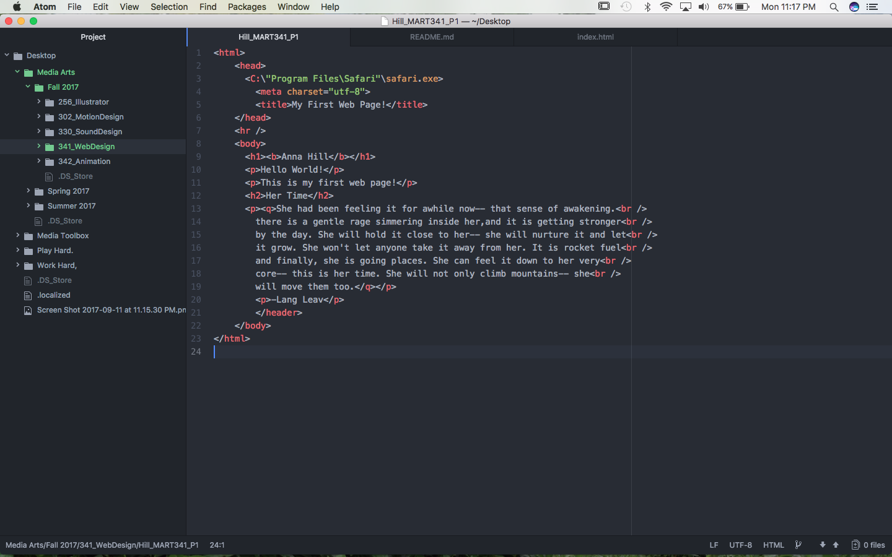
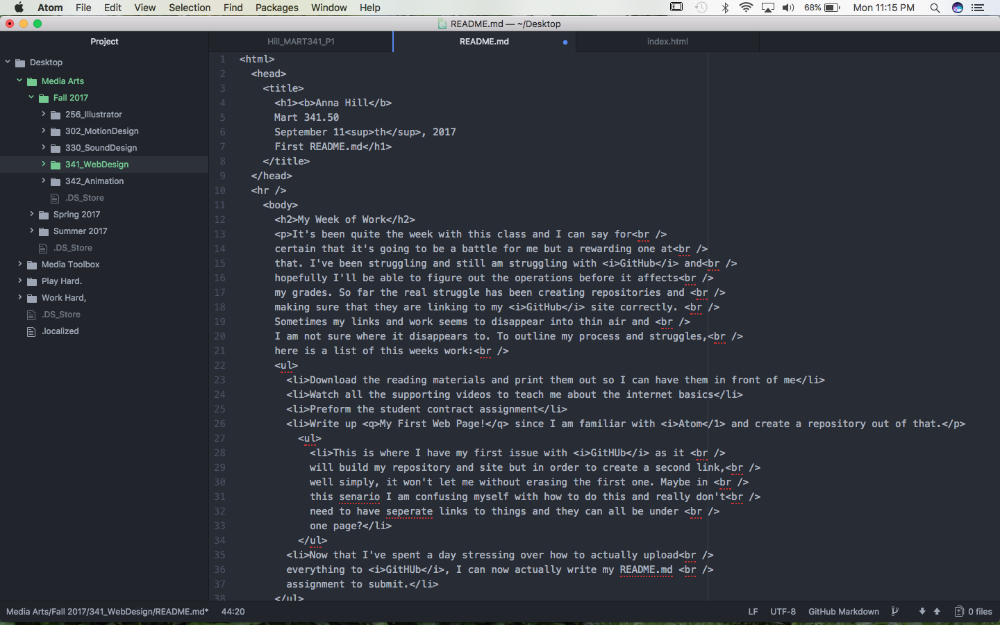
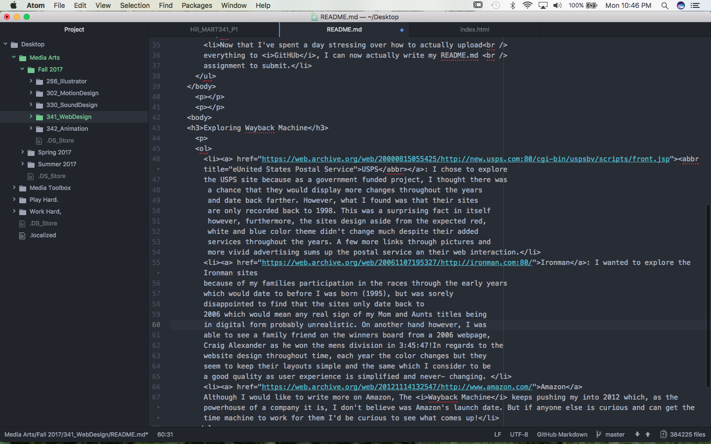

# annalhill.github.io
# Anna Hill

Mart 341.50
September 11th, 2017
First README.md

---

## Week One- Project 1

It's been quite the week with this class and I can say for 
certain that it's going to be a battle for me but a rewarding one at that. I've been struggling and still am struggling with _GitHub_ and hopefully I'll be able to figure out the operations before it affects my grades. So far the real struggle has been creating repositories and  making sure that they are linking to my _GitHub_ site correctly.  Sometimes my links and work seems to disappear into thin air and  I am not sure where it disappears to. To outline my process and struggles, here is a list of this weeks work:
- Download the reading materials and print them out so I can have them in front of me
- Watch all the supporting videos to teach me about the internet basics
- Preform the student contract assignment
- Write up <q>My First Web Page!</q> since I am familiar with <i>Atom</i> and create a repository out of that.
  - This is where I have my first issue with <i>GitHUb</i> as it will build my repository and site but in order to create a second link, well simply, it won't let me without erasing the first one. Maybe in this scenario I am confusing myself with how to do this and really don't need to have separate links to things and they can all be under one page?    
  - Now that I've spent a day stressing over how to actually upload everything to <i>GitHUb</i>, I can now actually write my README.md assignment to submit.

---

[A link to my published work](annalhill.github.io)

You'll Find that The screenshots below are of my previous work and that my work has been proof- read and my work should display correctly and with Markdown/ HTML language.

1. [USPS](https://web.archive.org/web/20000815055425/http://new.usps.com:80/cgi-bin/uspsbv/scripts/front.jsp): I chose to explore
  the USPS site because as a government funded project, I thought there was
   a chance that they would display more changes throughout the years
   and date back farther. However, what I found was that their sites
   are only recorded back to 1998. This was a surprising fact in itself
   however, furthermore, the sites design aside from the expected red,
   white and blue color theme didn't change much despite their added
   services throughout the years. A few more links through pictures and
   more vivid advertising sums up the postal service an their web interaction.

2. [Ironman](https://web.archive.org/web/20061107195327/http://ironman.com:80/): I wanted to explore the Ironman sites
  because of my families participation in the races through the early years
  which would date to before I was born (1995), but was sorely
  disappointed to find that the sites only date back to
  2006 which would mean any real sign of my Mom and Aunts titles being
  in digital form probably unrealistic. On another hand however, I was
  able to see a family friend on the winners board from a 2006 webpage,
  Craig Alexander as he won the mens division in 3:45:47! In regards to the
  website design throughout time, each year the color changes but they
  seem to keep their layouts simple and the same which I consider to be
  a good quality as user experience is simplified and never- changing.

3. [Amazon](https://web.archive.org/web/20121114132547/http://www.amazon.com/)
  Although I would like to write more on Amazon, The <i>Wayback Machine</i> keeps pushing my into 2012 which, as the powerhouse of a company it is, I don't believe was Amazon's launch date. But if anyone else is curious and can get the time machine to work for them I'd be curious to see what comes up!</li>
</ol>

<body>
<h4>Questions?</h4>

<a href="mailto:anna.hill@umconnect.umt.edu">Email Anna</a>

</body>

## Week 2- Project 1

I suppose that during this week I didn't have much to do except brush up on my HTML language. I made the mistake, or you could say it was a wonderful happening, to submit my repo 1 and live site a week early. This may have made less work for me but it also have me an opportunity to go over my work and realize that I didn't even have to use HTML for this assignment, simply markdown language.

## Week 3- Project 2

This week I struggled a bit with my work, mostly because I have confused myself over the tree that links Atom to Github desktop to Github. This has proved to be terribly inconvenient and I plan to get some help to sort that out this week. Otherwise however, I feel as though my HTML skills are slowly coming together as I learn to integrate some CSS language in to complete a more fluid piece of work.

## Week 4- Project 2

Seeing as the materials for this week weren't posted, I didn't have much work to do however I believe that I went overboard on my first repo of project 2. That means I included a color background as well as the recipe directions, which were to be added this week from my understanding.

Intro To Web Design Project 2

## October 7, 2018- October 9, 2017 Progress Updates

### This is the first new step I am taking in order to produce a new Repo that will allow me to create a multi- page Web Page for Project 2 of Intro to Web Development.

### I was able to develop two new html links that I will create an index for in the index.html file. This will allow me to have a home page and from there branch out into the instructions and ingredients page, or if I can manage to connect the two, the viewer will be able to see both pages stacked so they don't have to look at them separately. I am not sure if I should be placing an about or contact page to this as well??

### I just updated the colors in my .html files so that you could actually read the text presented on the pages. Although upon trying to se the outcome I realized that there is no posted web page and I am not sure how to bring this up and get it running. The only this that shows up is my original repo right now.

### So I have now added an index to my index.html allowing me to define the pages within my web page. I have also added a .ai image that I created and added via an adobe.pdf file in hopes that the content will turn out better as well as fit in my web dimensions (this is something I do not yet know how to alter in html code but I will look further into when I can figure out how to bring up my web page on the interwebs).
