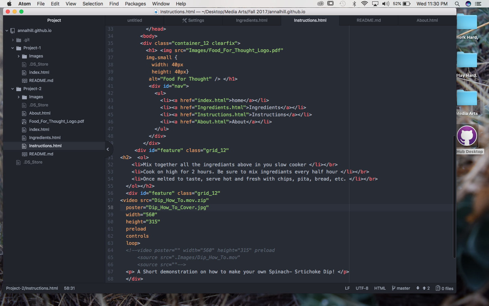

## Intro_Web_Dev_P2
Intro To Web Design Project 2

## October 7, 2018- October 9, 2017 Progress Updates

### This is the first new step I am taking in order to produce a new Repo that will allow me to create a multi- page Web Page for Project 2 of Intro to Web Development.

### I was able to develop two new html links that I will create an index for in the index.html file. This will allow me to have a home page and from there branch out into the instructions and ingredients page, or if I can manage to connect the two, the viewer will be able to see both pages stacked so they don't have to look at them separately. I am not sure if I should be placing an about or contact page to this as well??

### I just updated the colors in my .html files so that you could actually read the text presented on the pages. Although upon trying to se the outcome I realized that there is no posted web page and I am not sure how to bring this up and get it running. The only this that shows up is my original repo right now.

### So I have now added an index to my index.html allowing me to define the pages within my web page. I have also added a .ai image that I created and added via an adobe.pdf file in hopes that the content will turn out better as well as fit in my web dimensions (this is something I do not yet know how to alter in html code but I will look further into when I can figure out how to bring up my web page on the interwebs).

### Today I went and worked with Dr. Musick to fix up the order of my files in order to produce a live page. After managing to do that I went to work on images. However, with no such luck my images are wonky and enlarged across my page. I apologize for turning them in like that but I need to find one on one help in order to make a change because I obviously do not know my dimensions and orders... etc.

### An update on the progress of my image sizing and availability is that after working with Dr. Musick on Wednesday, we were able to stick to a simple HTML format for uploading images and then I simply needed to then format the dimensions (width and height) to my preferences.

## Wednesday October 28, 2017

### My brain hurt so I took a bit of a break but here I am back at it just getting the last of my links inout for the map and two videos.Hopefully I won't have any issues but I'm feeling pretty good about HTML right now and linking files.

### I found that I did run into one issue whilst truing to embed a home produced video simply because it kept being too large of a file for GitHub to handle. Below is an example of how I tried to upload it but failed. I will try and work on this with an instructor tomorrow however to make a change.

